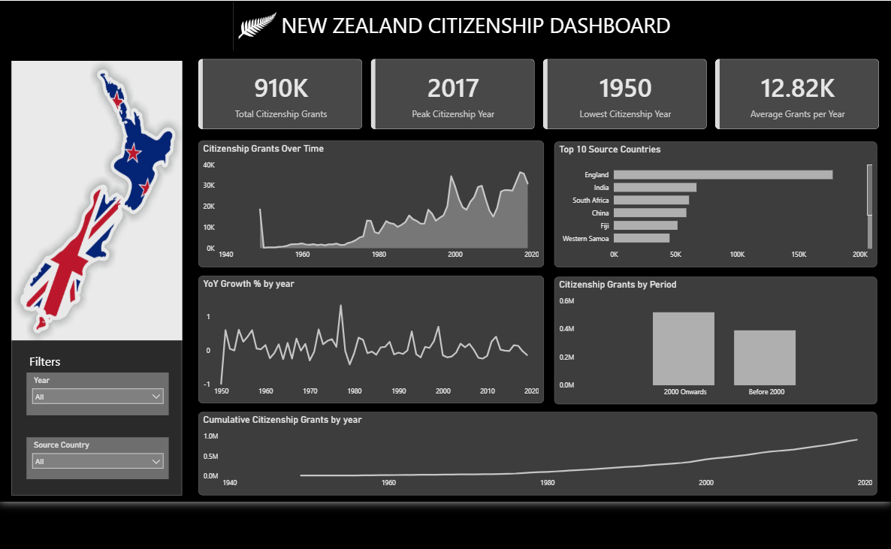
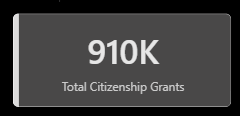
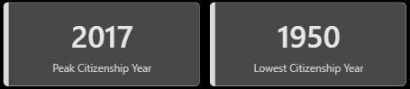
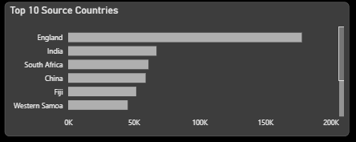
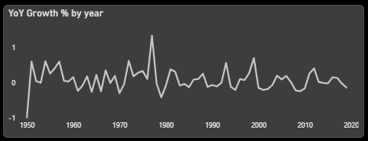
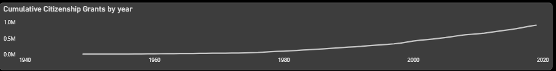

# NZ Citizenship Dashboard

NZ Citizenship 
Dashboard Link : https://kcgcollege0-my.sharepoint.com/:u:/g/personal/21it63_kcgcollege_com/IQA0vWf2UKKvQ59pzqlzQAT4ASj88ae2O3tXLUq1ySAp7j8?e=v6Ux2n

## Problem Statement

This dashboard helps analyze New Zealand citizenship trends over time. It enables users to understand how citizenship grants have changed across years, identify peak and low periods, and evaluate contributions from different source countries.

It also highlights long-term growth patterns and allows users to explore the data interactively using filters.

## Objective

+ Analyze historical trends in citizenship grants

+ Identify peak and lowest performing years

+ Understand contribution by top source countries

+ Evaluate long-term and cumulative growth

+ Enable interactive analysis using filters

## Steps followed

Step 1 : Loaded dataset into Power BI Desktop.

Step 2 : Opened Power Query Editor and performed data validation using column quality and profiling tools.

Step 3 : Checked for missing or inconsistent values and ensured clean data for analysis.

Step 4 : Created required measures using DAX for total grants, average grants, and key indicators.

Step 5 : Designed the dashboard layout with a structured black-and-white theme.

Step 6 : Added KPI cards for total grants, peak year, lowest year, and average grants per year.

Step 7 : Created a line chart to show citizenship trends over time.

Step 8 : Added a bar chart to display top source countries contributing to citizenship grants.

Step 9 : Built a line chart for year-over-year growth percentage.

Step 10 : Created a column chart to compare citizenship grants by period (before and after 2000).

Step 11 : Added a cumulative trend chart to visualize long-term growth.

Step 12 : Implemented slicers for year and source country to enable interactive filtering.

Step 13 : Inserted shapes and icons to enhance the visual design and layout.

Step 14 : Published the report to Power BI Service.

## Data Modeling

+ Data structured in a tabular format with key fields: Year, Source Country, and Grants

+ Measures created using DAX for aggregation and analysis

+ Ensured clean relationships and optimized model for performance

## Dashboard Features

+ KPI Cards : Display key metrics such as total grants, peak year, lowest year, and averages

+ Trend Analysis : Citizenship grants over time

+ Top Countries : Country-wise contribution

+ Growth Analysis : Year-over-year trend visualization

+ Period Comparison : Before vs after 2000 analysis

+ Cumulative Trend : Long-term growth representation

+ Interactive Filters : Year and source country slicers

## Insights

Following insights can be drawn from the dashboard:

[1] Overall Citizenship Trends
Total citizenship grants reached approximately 910K.
Citizenship shows a steady increase over time with noticeable growth after 2000.

[2] Peak and Lowest Years
Highest citizenship grants recorded in 2017.
Lowest activity observed in 1950, indicating early-stage migration levels.

[3] Source Country Contribution
A few countries contribute the majority of citizenship grants.
Top countries dominate overall distribution, indicating concentrated migration patterns.

[4] Growth Patterns
Year-over-year growth shows fluctuations but maintains an overall upward trend. Significant growth periods are visible in recent decades.

[5] Long-Term Trend
Cumulative citizenship grants show consistent growth over time.
Indicates sustained increase in migration and naturalization.

## Tools & Technologies
+ Power BI

+ DAX (Data Analysis Expressions)

+ Power Query

+ Data Modeling

+ Data Visualization

## Conclusion

This dashboard provides a clear and structured view of citizenship trends in New Zealand. It enables data-driven insights into growth patterns, key contributing countries, and long-term changes, supporting better understanding and analysis of migration trends.
